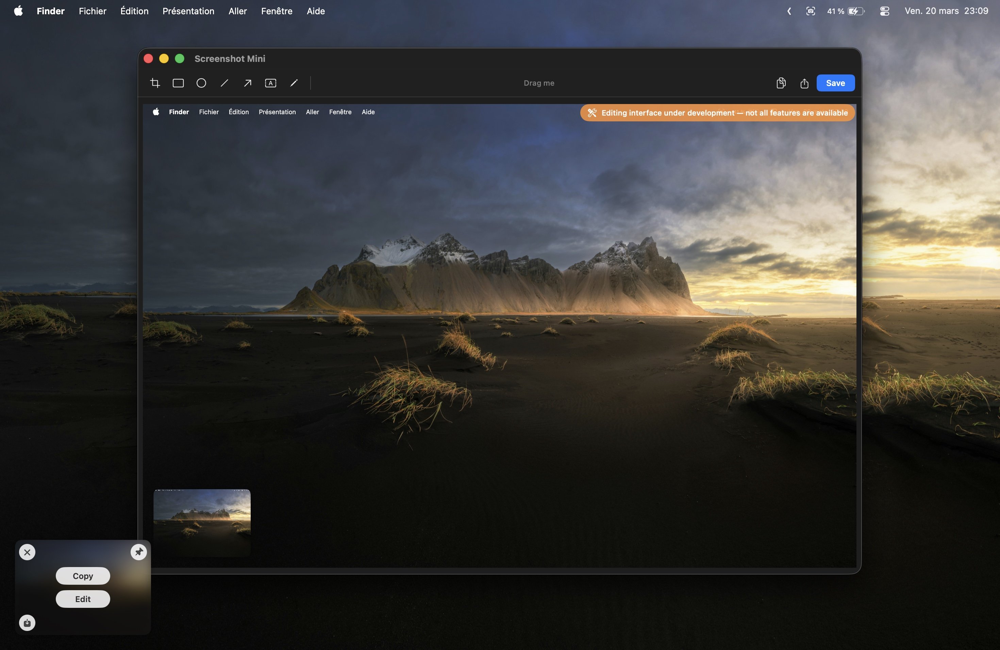

# Orby

<p align="center">
  
</p>

A lightweight macOS menu bar screenshot app inspired by CleanShot X — simpler, faster, free.

Available in **English** and **French**.

## Features

- **Full screen & area capture** — Configurable global hotkeys
- **OCR text capture** — Select a zone, extract text to clipboard (Vision framework)
- **Floating preview** — Appears after capture with Copy, Edit, Save, Pin actions
- **Built-in editor** — Annotation tools (in development), drag & drop, save
- **Drag & drop** — Drag screenshots directly to Finder, browser, or any app
- **Swipe to dismiss** — Trackpad gesture to close previews
- **Multiple previews** — Stack or single mode, auto-dismiss with configurable delay
- **Customizable** — Preview position, image format (PNG/JPEG/TIFF), sounds, auto-actions
- **Bilingual** — Full French and English interface

## Download

Grab the latest `.dmg` from the [Releases](https://github.com/jeremy-prt/orby/releases) page.

Or visit the [landing page](https://jeremy-prt.github.io/orby/) for more info.

## Install

1. Open the `.dmg` and drag the app to `/Applications`
2. Double-click the app — macOS will block it
3. Go to **System Settings → Privacy & Security** → click **Open Anyway**
4. Grant **Screen Recording** permission when prompted

> **Why is this needed?** This is an open-source project by an independent developer. The app is not signed with an Apple Developer certificate ($99/year), so macOS blocks it on first launch. The app is fully safe — you can review the source code yourself.

> **Terminal alternative:** `xattr -cr /Applications/Screenshot\ Mini.app`

## Build from source

Requires **macOS 26+** and **Xcode 26+** (Swift 6.2).

```bash
git clone git@github.com:jeremy-prt/orby.git
cd orby
bash build-app.sh      # Build the .app bundle
# bash build-dmg.sh    # Build the .dmg installer (requires create-dmg)
```

The app bundle will be at `.build/app/Orby.app`.

## How it works

- **Capture** uses the native macOS `screencapture` CLI — no ScreenCaptureKit, no complex permissions
- **OCR** uses Apple's Vision framework (`VNRecognizeTextRequest`) — fully offline, no API needed
- **Preview** is a floating `NSPanel` with SwiftUI overlay — non-activating, stays above other windows
- **Editor** opens in a standard `NSWindow` with toolbar and canvas

## Keyboard shortcuts

Configure in **Settings → Shortcuts**:

| Action | Default |
|--------|---------|
| Full screen capture | *(set in settings)* |
| Area capture | *(set in settings)* |
| OCR text capture | *(set in settings)* |

## Settings

| Tab | Options |
|-----|---------|
| **General** | Launch at login, menu bar icon, capture sound, language, OCR language |
| **Shortcuts** | Full screen, area, OCR hotkeys |
| **Capture** | After-capture actions, preview position, stacking, auto-dismiss, close after action |
| **Save** | Image format (PNG/JPEG/TIFF), destination folder |

## License

[MIT](LICENSE)

Made by [Jeremy Perret](https://github.com/jeremy-prt)
